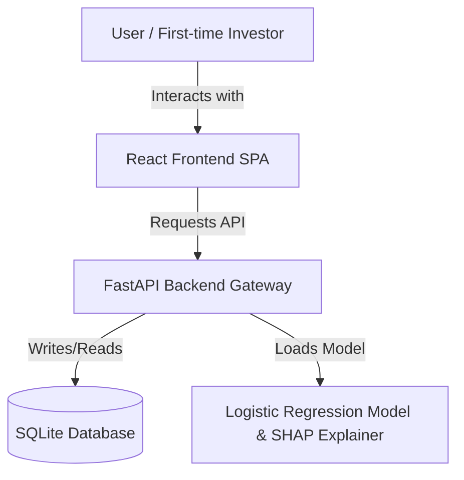
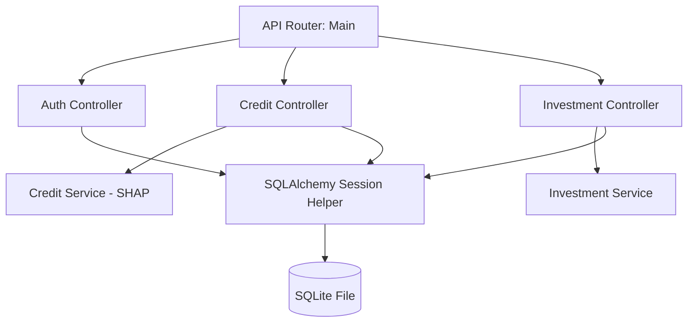
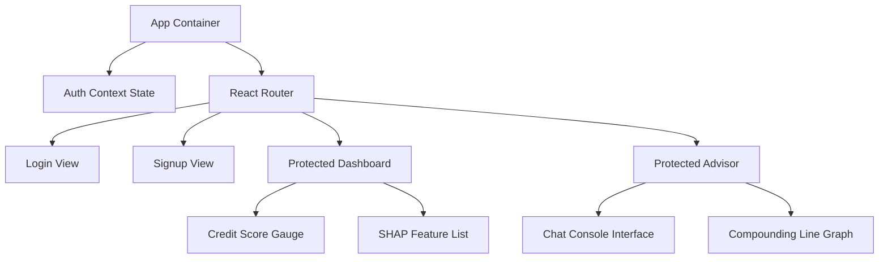
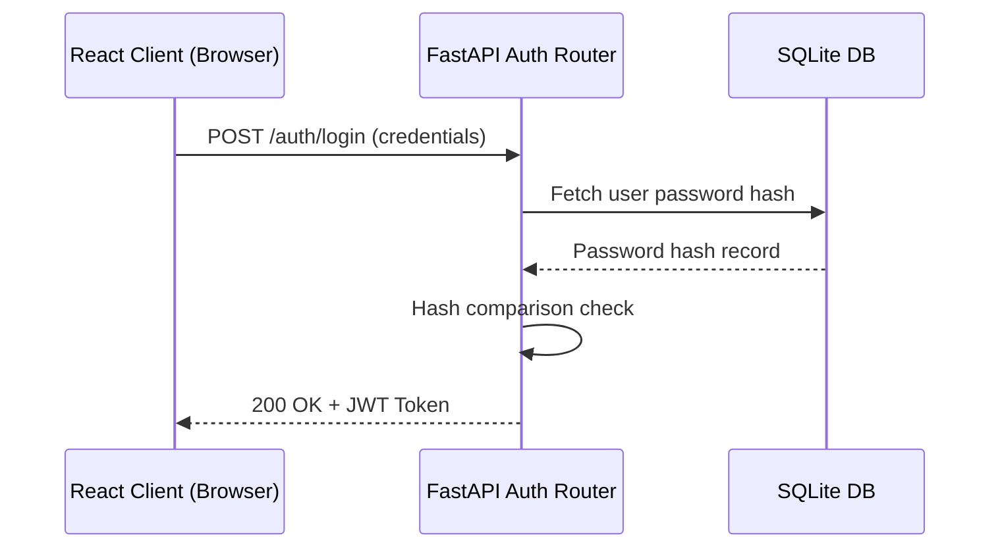
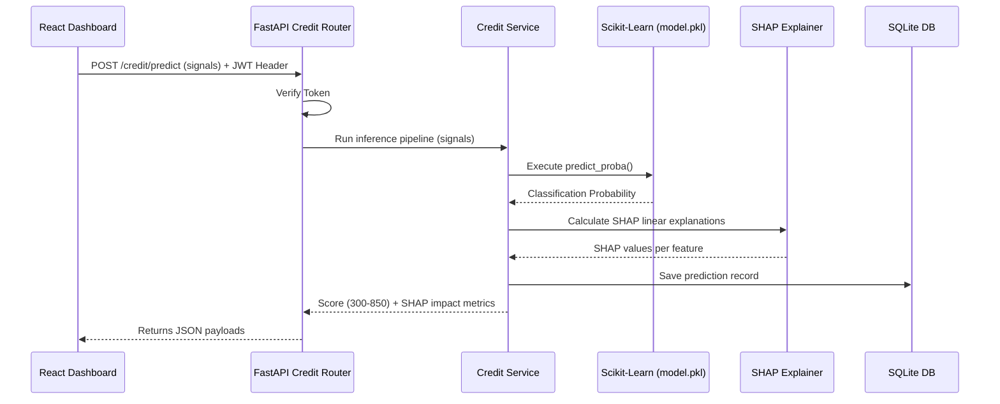
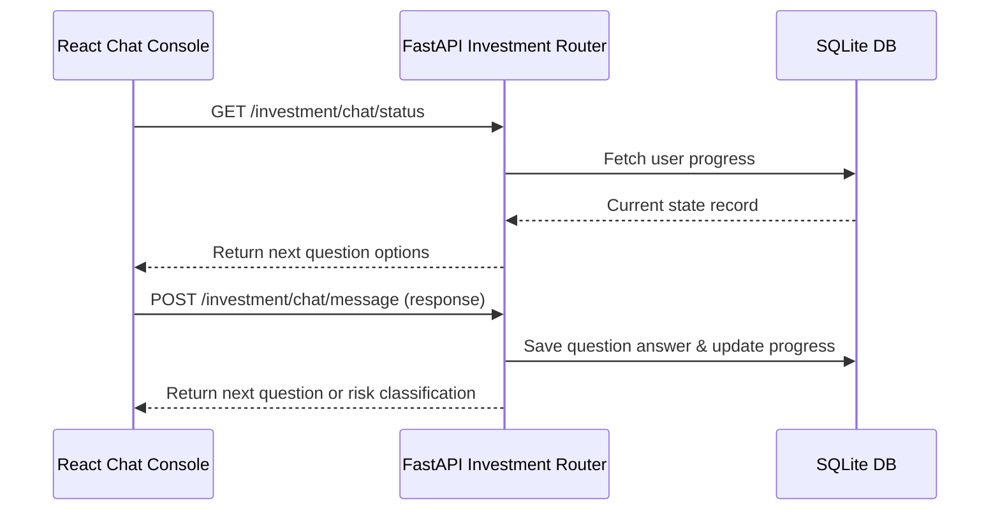
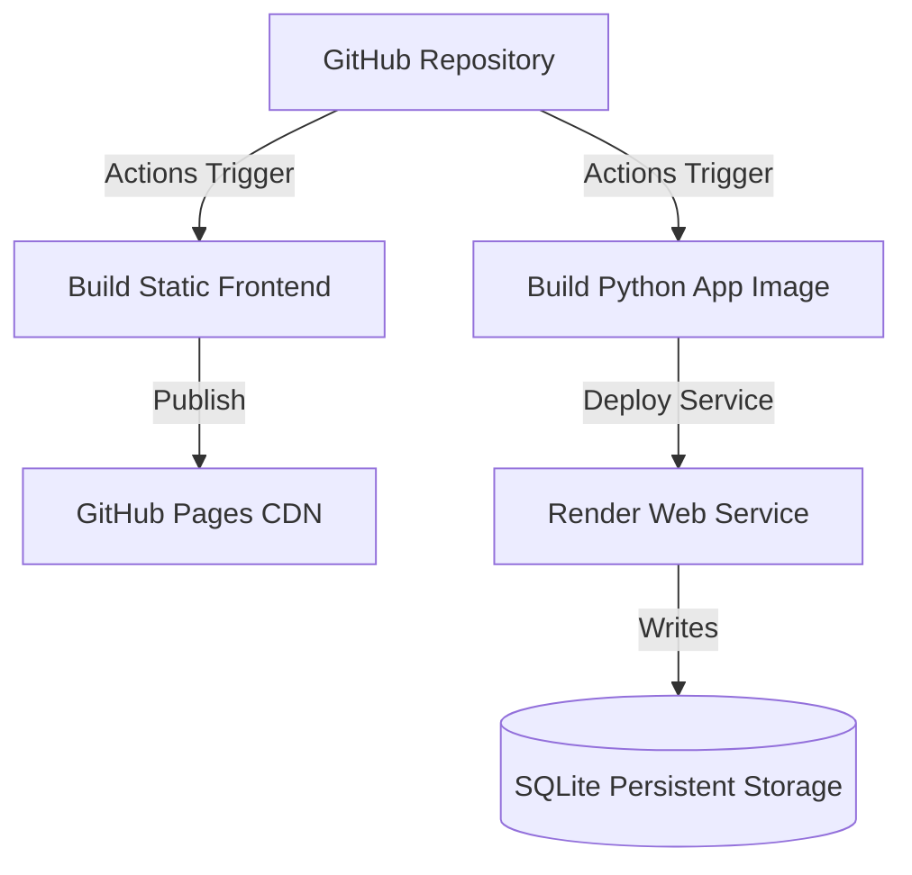

# Title: Architecture Specification - Credit Compass
* **Version**: v1.0.0
* **Purpose**: Technical architecture mapping out system components, data sequences, model pipelines, and deployment structures.
* **Author**: Team Credit Compass (A, B, C, D)
* **Last Updated**: 2026-07-17
* **Dependencies**: [TechSpec.md](file:///c:/Users/DP/Documents/Programming Languages/Credt_Compass/Credit_Compass/docs/TechSpec.md)
* **Related Documents**: [Schema.md](file:///c:/Users/DP/Documents/Programming Languages/Credt_Compass/Credit_Compass/docs/Schema.md), [API_Documentation.md](file:///c:/Users/DP/Documents/Programming Languages/Credt_Compass/Credit_Compass/docs/API_Documentation.md)

---

## Table of Contents
1. [High-Level Architecture (C4 Model Context)](#high-level-architecture-c4-model-context)
2. [Container Architecture](#container-architecture)
3. [Component Architectures](#component-architectures)
   - [Backend Component Diagram](#backend-component-diagram)
   - [Frontend Component Diagram](#frontend-component-diagram)
4. [Sequence & Process Flows](#sequence--process-flows)
   - [Authentication Protocol Sequence](#authentication-protocol-sequence)
   - [AI Inference & SHAP Flow Sequence](#ai-inference--shap-flow-sequence)
   - [Conversational Advisor Sequence](#conversational-advisor-sequence)
5. [Machine Learning Pipeline Flow](#machine-learning-pipeline-flow)
6. [Deployment Architecture](#deployment-architecture-1)
7. [Implementation Notes & Assumptions](#implementation-notes--assumptions)

---

## High-Level Architecture (C4 Model Context)
The overall system separates client-side rendering from core server resources.

---

## Container Architecture
- **Web App (React/Vite)**: Deployed to GitHub Pages. Executes in the user's browser, handles state management, and renders dashboards.
- **REST API (FastAPI)**: Running as an asynchronous service on Render. Receives requests, verifies JWT tokens, queries the database, and processes models.
- **Database (SQLite)**: File-based relational database stored on Render. Holds records for users, signals, predictions, and portfolios.

---

## Component Architectures

### Backend Component Diagram
FastAPI manages routing, dependencies, and connections.

### Frontend Component Diagram
React handles route protection and data rendering.

---

## Sequence & Process Flows

### Authentication Protocol Sequence

### AI Inference & SHAP Flow Sequence

### Conversational Advisor Sequence

---

## Machine Learning Pipeline Flow
1. **Inputs**: Users submit five alternative financial signals via the dashboard.
2. **Preprocessing**: The inputs are formatted into feature vectors and scaled using a standard scaler.
3. **Inference**: The pre-trained Logistic Regression model calculates default likelihood probabilities.
4. **SHAP Analysis**: The model computes Shapley values, scales them, and maps the top features to human-readable explanations.

---

## Deployment Architecture

---

## Implementation Notes & Assumptions
- **Scaling considerations**: Transitioning to PostgreSQL in later phases is straightforward because the database layer is abstracted using SQLAlchemy models.
- **Render Limits**: Render's free tier spins down after periods of inactivity. The React client handles this by showing a loading spinner when waking up backend services.
- **Model Storage**: The model file (`model.pkl`) is stored in the Git repository to simplify and speed up deployments.
