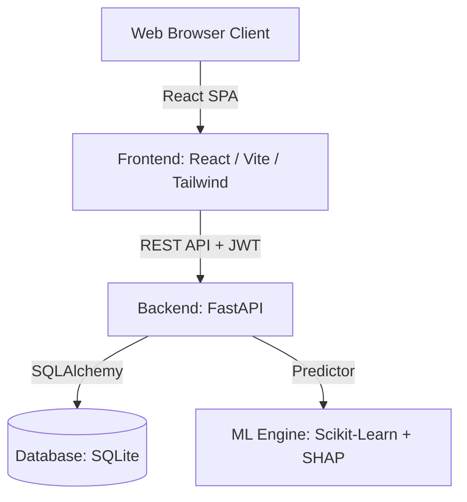

# Title: Credit Compass Project Readme
* **Version**: v1.0.0
* **Purpose**: High-level repository landing page and workspace directory documentation.
* **Author**: Team Credit Compass (A, B, C, D)
* **Last Updated**: 2026-07-17
* **Dependencies**: None
* **Related Documents**: [PRD.md](file:///c:/Users/DP/Documents/Programming Languages/Credt_Compass/Credit_Compass/docs/PRD.md), [TechSpec.md](file:///c:/Users/DP/Documents/Programming Languages/Credt_Compass/Credit_Compass/docs/TechSpec.md), [Architecture.md](file:///c:/Users/DP/Documents/Programming Languages/Credt_Compass/Credit_Compass/docs/Architecture.md), [DeploymentGuide.md](file:///c:/Users/DP/Documents/Programming Languages/Credt_Compass/Credit_Compass/docs/DeploymentGuide.md)

---

## Table of Contents
1. [Project Overview](#project-overview)
2. [Problem Statement](#problem-statement)
3. [The Solution](#the-solution)
4. [Key Features](#key-features)
5. [System Architecture](#system-architecture)
6. [Installation & Setup](#installation--setup)
7. [Running Locally](#running-locally)
8. [Folder Structure Overview](#folder-structure-overview)
9. [API Overview](#api-overview)
10. [Machine Learning Pipeline](#machine-learning-pipeline)
11. [Deployment Strategy](#deployment-strategy)
12. [Future Scope](#future-scope)
13. [Contributors & Roles](#contributors--roles)
14. [Educational Disclaimer & License](#educational-disclaimer--license)
15. [Implementation Notes & Assumptions](#implementation-notes--assumptions)

---

## Project Overview
**Credit Compass** is an explainable AI-powered FinTech platform designed to provide transparent credit likelihood prediction using alternative financial signals and conversational investment risk profiling. It targets individuals who are credit-invisible, college students, young professionals, and first-time investors.

---

## Problem Statement
Traditional credit bureaus rely on rigid historical credit data (credit cards, loans, mortgages). This excludes millions of "credit-invisible" individuals who have steady income, pay bills on time, but do not participate in formal debt systems. Furthermore, traditional financial advice is often gatekept, complex, or non-transparent, which deters college students and young professionals from early-stage investing.

---

## The Solution
Credit Compass addresses this gap with two core engines:
1. **Alternative Credit Likelihood Scoring (Explainable AI)**: Using non-traditional markers (e.g., utility payments, rental history, subscription consistency, savings rates) to predict credit likelihood, accompanied by **SHAP (SHapley Additive exPlanations)** to break down exactly which behaviors impacted the score.
2. **Conversational Micro-Investment Advisor**: A chat-based profiling assistant that evaluates user risk tolerance and automatically constructs a personalized, educational, simulated investment growth plan.

---

## Key Features
- **User Authentication**: Secure JWT-based auth flow with basic signup/login.
- **Alternative Credit Dashboard**: Clear, visual gauge showing predicted credit likelihood using alternative indicators.
- **Explainable AI (XAI)**: Highlighting the top 3 positive and negative contributors to the score using SHAP graphs.
- **Personalized Recommendations**: Tailored action items to improve credit standing.
- **Conversational Risk Profiling**: Interactive chat interface to assess investment comfort levels.
- **Micro-Investment Growth Simulator**: Educational growth projections (e.g., ETFs, crypto, bonds) with interactive charts.
- **Responsive Dark Theme**: Modern glassmorphism UI styled with Tailwind CSS, inspired by CRED, Stripe, and Linear.

---

## System Architecture



---

## Installation & Setup

### Prerequisites
- Python 3.10+
- Node.js 18+
- npm 9+

### Backend Setup
1. Clone the repository and navigate to the backend folder:
   ```bash
   cd backend
   ```
2. Create and activate a Python virtual environment:
   ```bash
   python -m venv venv
   source venv/Scripts/activate  # On Windows: venv\Scripts\activate
   ```
3. Install dependencies:
   ```bash
   pip install -r requirements.txt
   ```
4. Set up the local `.env` configuration file:
   ```env
   SECRET_KEY=supersecretjwtkeyforcreditcompass2026
   DATABASE_URL=sqlite:///./credit_compass.db
   ENVIRONMENT=development
   ```
5. Initialize the database and load synthetic data:
   ```bash
   python scripts/init_db.py
   ```

### Frontend Setup
1. Navigate to the frontend folder:
   ```bash
   cd ../frontend
   ```
2. Install dependencies:
   ```bash
   npm install
   ```
3. Create `.env` file:
   ```env
   VITE_API_BASE_URL=http://localhost:8000/api/v1
   ```

---

## Running Locally

### Start Backend Dev Server
```bash
cd backend
uvicorn app.main:app --reload --port 8000
```
- Swagger Docs available at: [http://localhost:8000/docs](http://localhost:8000/docs)

### Start Frontend Dev Server
```bash
cd frontend
npm run dev
```
- App available at: [http://localhost:5173](http://localhost:5173)

---

## Folder Structure Overview
For a complete breakdown, see [FolderStructure.md](file:///c:/Users/DP/Documents/Programming Languages/Credt_Compass/Credit_Compass/docs/FolderStructure.md).
- `/backend`: FastAPI codebase, database configuration, ML pipelines, and models.
- `/frontend`: React SPA, assets, routing, and UI elements.
- `/docs`: Full project documentation including this file.

---

## API Overview
The backend exposes REST endpoints under `/api/v1`. For detailed definitions, payload formats, and status codes, check [API_Documentation.md](file:///c:/Users/DP/Documents/Programming Languages/Credt_Compass/Credit_Compass/docs/API_Documentation.md).

| Method | Endpoint | Description | Auth Required |
|--------|----------|-------------|---------------|
| POST | `/auth/signup` | Create a new user profile | No |
| POST | `/auth/login` | Retrieve a JWT access token | No |
| GET | `/credit/score` | Get predicted credit score & SHAP explainability data | Yes |
| POST | `/credit/predict` | Input signals and predict likelihood | Yes |
| GET | `/investment/chat` | Get conversation status & risk assessment questions | Yes |
| POST | `/investment/chat/message` | Send message to profiling agent | Yes |
| GET | `/investment/portfolio` | Retrieve recommended portfolio & growth metrics | Yes |

---

## Machine Learning Pipeline
- **Algorithm**: Logistic Regression classifier trained on alternative data (savings ratio, payment delays, utilities, phone bills, subscription counts).
- **Explainability**: SHAP (SHapley Additive exPlanations) is utilized to generate localized feature contributions.
- **Pipeline Stages**:
  1. Preprocessing: Scikit-learn Pipelines with `StandardScaler` and simple imputation.
  2. Inference: Predicts credit probability class.
  3. SHAP Calculation: Custom wrapper to extract feature importance scores on demand for the user profile.

---

## Deployment Strategy
- **Frontend**: Single Page Application (SPA) deployed to **GitHub Pages** via GitHub Actions.
- **Backend**: Python ASGI server running on **Render** (Web Service tier).
- **Database**: Persistent SQLite volume or in-memory SQLite seed for fast demo deployments.

---

## Future Scope
See [FutureEnhancements.md](file:///c:/Users/DP/Documents/Programming Languages/Credt_Compass/Credit_Compass/docs/FutureEnhancements.md) for detailed descriptions.
- Phase 2: Integration of real banking APIs (Plaid / Yodlee) to eliminate manual entry.
- Phase 3: OCR parsing of rent and utility statements via LLMs.
- Phase 4: Voice-enabled financial assistant for conversational risk assessment.

---

## Contributors & Roles
- **Member A**: Lead ML Engineer & API Integrator.
- **Member B**: Backend Architect & Authentication Lead.
- **Member C**: Frontend Developer & Chart Visualizations Designer.
- **Member D**: UI/UX Specialist & Product Lead.
For task allocations, see [TeamResponsibilities.md](file:///c:/Users/DP/Documents/Programming Languages/Credt_Compass/Credit_Compass/docs/TeamResponsibilities.md).

---

## Educational Disclaimer & License
### Disclaimer
> [!WARNING]
> Credit Compass is a simulated educational tool. All credit scores, predictions, and investment growth models are synthetic and generated for demonstration purposes only. This system does not constitute financial, investment, legal, or credit advice.

### License
This project is licensed under the MIT License. See [LICENSE](file:///c:/Users/DP/Documents/Programming Languages/Credt_Compass/Credit_Compass/LICENSE) for details.

---

## Implementation Notes & Assumptions
- **Assumption 1**: The synthetic dataset is statically generated during initialization, containing 5,000 credit profiles.
- **Assumption 2**: Alternative credit scoring uses a simplified model calibrated against traditional credit ranges to make the scores recognizable (e.g., range 300 - 850).
- **Edge Case**: Users with zero alternative indicators will default to a neutral, middle-tier credit likelihood range with a warning flag indicating "Insufficient Alternative Signal Data."
- **Risk**: Over-reliance on local SQLite databases for concurrently hosted demos on Render. Render instance restarts will wipe SQLite files unless mounted to a persistent disk. We address this using a seed script on startup.
- **Recommendation**: Deploy Render using a persistent disk mount for SQLite or use an external cloud database (Supabase/PostgreSQL) in production. For the hackathon, automatic SQLite re-seeding is implemented.
