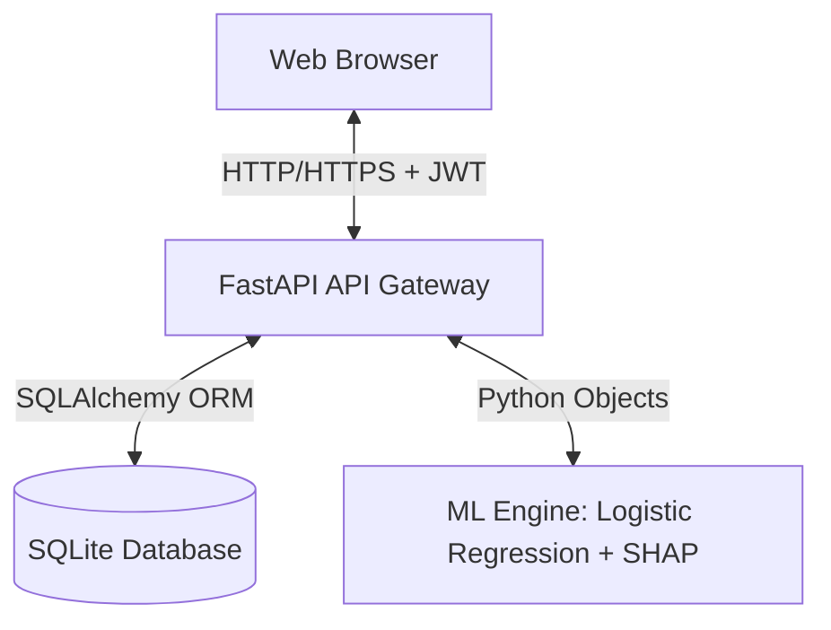
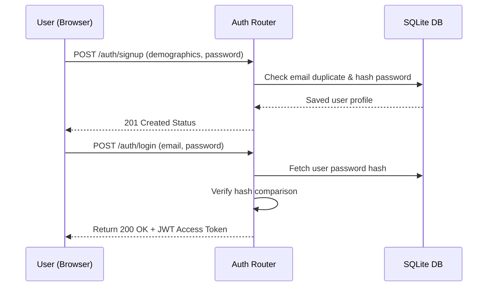
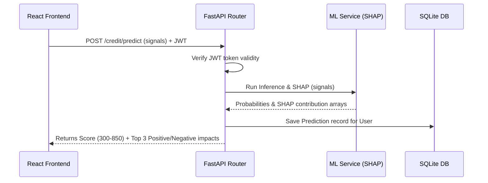

# Title: Technical Specification - Credit Compass
* **Version**: v1.0.0
* **Purpose**: Comprehensive technical blueprint for engineers building and deploying the Credit Compass platform.
* **Author**: Team Credit Compass (A, B, C, D)
* **Last Updated**: 2026-07-17
* **Dependencies**: [PRD.md](file:///c:/Users/DP/Documents/Programming Languages/Credt_Compass/Credit_Compass/docs/PRD.md)
* **Related Documents**: [Architecture.md](file:///c:/Users/DP/Documents/Programming Languages/Credt_Compass/Credit_Compass/docs/Architecture.md), [Schema.md](file:///c:/Users/DP/Documents/Programming Languages/Credt_Compass/Credit_Compass/docs/Schema.md), [API_Documentation.md](file:///c:/Users/DP/Documents/Programming Languages/Credt_Compass/Credit_Compass/docs/API_Documentation.md)

---

## Table of Contents
1. [Overall System Architecture](#overall-system-architecture)
2. [Frontend Architecture](#frontend-architecture)
3. [Backend Architecture](#backend-architecture)
4. [Machine Learning Pipeline & SHAP Explanations](#machine-learning-pipeline--shap-explanations)
5. [Authentication & Session Flow](#authentication--session-flow)
6. [Data Flow Sequence](#data-flow-sequence)
7. [React Component Hierarchy](#react-component-hierarchy)
8. [Folder Ownership & Responsibilities](#folder-ownership--responsibilities)
9. [API & Service Layers](#api--service-layers)
10. [Database Architecture & Storage Strategy](#database-architecture--storage-strategy)
11. [Security & Encryption Standards](#security--encryption-standards)
12. [Input Validation & Error Handling](#input-validation--error-handling)
13. [Logging & Caching Strategy](#logging--caching-strategy)
14. [Performance Targets & Scalability](#performance-targets--scalability)
15. [Environment Variables](#environment-variables)
16. [Deployment Architecture](#deployment-architecture)
17. [Implementation Notes & Edge Cases](#implementation-notes--edge-cases)

---

## Overall System Architecture
Credit Compass uses a decoupled **Client-Server Architecture**. The frontend is a React SPA, and the backend is a FastAPI ASGI service running on Python.



---

## Frontend Architecture
- **Framework**: React 18+ (using Vite as the build tool for fast hot module replacement).
- **Styling**: Tailwind CSS for building a responsive, clean, and interactive dark UI.
- **State Management**: React Context API for global authentication state; React local state (`useState`, `useReducer`) for conversational flows.
- **Data Fetching**: Axios instances with request interceptors to automatically attach JWT authorization headers.
- **Routing**: React Router DOM (v6) with path-guarding wrappers to block unauthorized users.
- **Visualization**: Recharts for rendering SVG-based responsive credit charts and projection lines.

---

## Backend Architecture
- **Framework**: FastAPI (Python 3.10+) utilizing Uvicorn for asynchronous requests.
- **ORM**: SQLAlchemy for object-relational mapping, keeping database engine operations abstract.
- **Migration Engine**: SQLite-compatible schema creation (runs auto-migration scripts during startup).
- **Routing Structure**: Hierarchical router mounting:
  - `/api/v1/auth` (User signup, logins, tokens)
  - `/api/v1/credit` (Inference calls, historical scores, SHAP explanations)
  - `/api/v1/investment` (Risk question fetching, chat messaging, simulations)

---

## Machine Learning Pipeline & SHAP Explanations
### Model Details
- **Algorithm**: Scikit-Learn `LogisticRegression(class_weight='balanced')`.
- **Target Variable**: Credit Likelihood class (0: Low, 1: Moderate, 2: High).
- **Features Used**:
  1. `savings_rate`: (Monthly Savings / Income) * 100
  2. `rent_delays`: Total days rent was late in the last 12 months.
  3. `utility_delays`: Total days utility bills were late in the last 12 months.
  4. `active_subscriptions`: Count of recurring subscriptions (indicator of recurring cash outflow).
  5. `debt_to_income`: Monthly debt service obligations / Gross monthly income.

### Explainability Engine
- **Library**: `shap`.
- **Method**: `LinearExplainer` (highly optimized for logistic regression coefficients).
- **Execution Flow**:
  1. Model predicts the probability array for the user's input vector.
  2. The SHAP Explainer computes the base value and shap values:
     $$\text{SHAP Value} = \phi_i(x)$$
  3. Output values are sent to the client as positive (helpful) or negative (harmful) indicators.

---

## Authentication & Session Flow



---

## Data Flow Sequence



---

## React Component Hierarchy
- `App.jsx`
  - `AuthProvider` (Global state provider)
  - `BrowserRouter`
    - `PublicLayout`
      - `Login.jsx`
      - `Signup.jsx`
    - `ProtectedLayout` (Validates JWT session)
      - `Navigation.jsx` (Glassmorphic sidebar/navbar)
      - `Dashboard.jsx` (Credit gauge, SHAP explanations)
        - `CreditGauge.jsx`
        - `ShapExplanationList.jsx`
        - `ImprovementTips.jsx`
      - `InvestmentAdvisor.jsx` (Conversational UI + Simulator)
        - `ChatConsole.jsx` (Iterative question/answer bubbles)
        - `PortfolioBreakdown.jsx` (Asset donut chart)
        - `GrowthSimulator.jsx` (Compound line graph with input sliders)
      - `Footer.jsx` (Persistent educational disclaimer)

---

## Folder Ownership & Responsibilities
- `/backend/app/api`: Handles incoming requests, validates models, routes to services.
- `/backend/app/services`: Contains core logic (ML model loading, run SHAP explainers, portfolio projections).
- `/backend/app/models`: Database schema blueprints (SQLAlchemy).
- `/backend/app/schemas`: Pydantic validation schemas.
- `/frontend/src/components`: UI atoms, molecules, and charts.
- `/frontend/src/context`: Authentication session state.
- `/frontend/src/pages`: Assembled route views.

---

## API & Service Layers
- **API Controllers**: Keep business operations light. They parse parameters, authenticate JWT tokens, and invoke service modules.
- **Service Layer**: State-free modules containing business logic:
  - `CreditService`: Manages credit predictions, scales values, and returns formatted SHAP datasets.
  - `InvestmentService`: Evaluates final answers to score user risk levels and calculates projected compounded balances.

---

## Database Architecture & Storage Strategy
- **Engine**: SQLite (chosen for simple zero-dependency hackathon configuration).
- **ORM Layer**: SQLAlchemy using async session helpers (`async_scoped_session`).
- **Connection Configuration**:
  - Pool size: 10 connections.
  - Transaction lock-timeout: 5 seconds.
  - Filepath: `./credit_compass.db`.

---

## Security & Encryption Standards
- **Password Protection**: Passwords hashed using `bcrypt` (rounds: 12).
- **Token Security**: JWT signatures use HMAC-SHA256. Secret keys are loaded dynamically from environment variables.
- **CORS Handling**: Middleware configured to allow restricted requests from authorized client endpoints (e.g., localhost during development, GitHub Pages domain in production).

---

## Input Validation & Error Handling
- **Data Validation**: Frontend performs form validations before API submissions. Backend uses **Pydantic** for typed request/response filtering.
- **Error Middleware**: Global exception interceptor catching database anomalies and unexpected runtime errors, translating them into standard client formats:
  ```json
  {
    "detail": "Descriptive error message",
    "error_code": "RESOURCE_NOT_FOUND"
  }
  ```

---

## Logging & Caching Strategy
- **Logging**: Python's standard `logging` module configured with a standard console output format:
  `[%(asctime)s] %(levelname)s in %(module)s: %(message)s`
- **Caching**: Since user metrics update infrequently, risk profile definitions and asset allocation configurations are cached in-memory inside the FastAPI service instance.

---

## Performance Targets & Scalability
- **Inference Speed**: Under 200ms for scoring calculations.
- **Asset Loading**: Compile JS/CSS files with Vite optimization to minimize client load times.
- **Concurrency**: Uvicorn configuration manages up to 100 concurrent requests without thread locks.

---

## Environment Variables

### Backend Variables (`backend/.env`)
```env
SECRET_KEY=yoursecrettokenkey
DATABASE_URL=sqlite:///./credit_compass.db
ENVIRONMENT=production
ALLOWED_ORIGINS=https://username.github.io,http://localhost:5173
```

### Frontend Variables (`frontend/.env`)
```env
VITE_API_BASE_URL=https://credit-compass-api.onrender.com/api/v1
```

---

## Deployment Architecture
- **Frontend Build**: Deployed as Static Assets to GitHub Pages. All routing fallbacks configure to `index.html` to support React Router refresh calls.
- **Backend Build**: FastAPI server deployed on Render Web Service.

---

## Implementation Notes & Edge Cases
- **Edge Case (Expired JWT)**: If a request returns `401 Unauthorized`, the frontend Axios interceptor automatically purges local storage token references and redirects the user to the log-in page.
- **Assumption (SQLite File Locks)**: Concurrently executing requests will not lock SQLite because database operations use quick connections.
- **Risk**: ML models fail to load from Disk.
- **Mitigation**: Fallback heuristic rules are embedded in `CreditService` to guarantee score outputs even if the model serialization file is corrupted.
